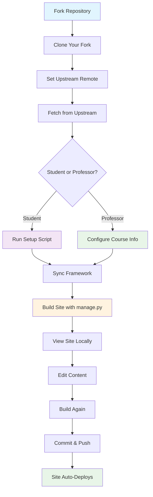

This tutorial walks you through the **complete process** from getting your own copy of the class repository to building and viewing your first website. Perfect for beginners and non-technical users.

## 🎯 Quick Overview (TL;DR)

**For Students:**
1. Fork → Set upstream → Fetch/Merge → Run setup script → Sync → Build → View
2. Later: Edit content → Build → Commit → Push

**For Professors:**
1. Fork/Clone → Configure course info → Build → Deploy
2. Later: Update content → Build → Deploy

---

## 📊 Complete Process Flow



---

## 🎓 STUDENT WORKFLOW

### Step 1: Fork the Repository
1. **Go to the class repository** (your instructor will provide the link)
   - Example: `https://github.com/instructor-username/class_template`
2. **Click the "Fork" button** (top right of the page)
3. **Choose your GitHub account** as the destination
4. **Wait for the fork to complete** (GitHub will redirect you to your fork)

**You now have**: `https://github.com/YOUR-USERNAME/class_template`

### Step 2: Clone Your Fork to Your Computer
Open your terminal (Command Prompt on Windows, Terminal on Mac/Linux) and run:

```bash
# Replace YOUR-USERNAME with your actual GitHub username
git clone https://github.com/YOUR-USERNAME/class_template.git

# Go into the repository folder
cd class_template
```

**What this does:** Downloads your copy of the repository to your computer so you can work on it.

### Step 3: Set Upstream Remote (Connect to Instructor)
This connects your fork to the instructor's original repository so you can get updates:

```bash
# Replace INSTRUCTOR-USERNAME with your instructor's GitHub username
git remote add upstream https://github.com/INSTRUCTOR-USERNAME/class_template.git

# Verify it worked (you should see 'origin' and 'upstream')
git remote -v
```

**You should see:**
```
origin    https://github.com/YOUR-USERNAME/class_template.git (fetch)
origin    https://github.com/YOUR-USERNAME/class_template.git (push)
upstream  https://github.com/INSTRUCTOR-USERNAME/class_template.git (fetch)
upstream  https://github.com/INSTRUCTOR-USERNAME/class_template.git (push)
```

### Step 4: Get Latest Updates from Instructor
Before starting, get any updates your instructor may have made:

```bash
# Fetch all updates from instructor
git fetch upstream

# Merge instructor's changes into your main branch
git merge upstream/main
```

**What this does:** Ensures you have the latest content and framework before you start working.

### Step 5: Run the Student Setup Script
This creates your personal student directory and sets everything up:

```bash
# Make sure you're in the repository root (you should see 'students/' folder)
ls

# Run the setup script with YOUR GitHub username
./students/start.sh YOUR-USERNAME
```

**Example:** If your GitHub username is `alice`:
```bash
./students/start.sh alice
```

**What you'll see:**
```
🚀 Setting up student directory for: alice
📁 Creating directory structure...
📋 Copying configuration files...
📚 Creating content directories...
🔄 Running initial sync...
⚙️ Generating Hugo configuration...
✅ Setup complete! Your directory is ready at students/alice/
```

### Step 6: Navigate to Your Directory
```bash
# Go to your student directory
cd students/YOUR-USERNAME

# Example: cd students/alice
```

**Important:** From now on, you'll work inside this directory. This is YOUR space in the repository.

### Step 7: Sync Framework and Build Your Site
Use the management script to sync the latest framework and build your site:

```bash
# Sync framework from professor (gets latest tools/themes)
python3 professor/framework_code/scripts/manage.py --sync

# Build your website
python3 professor/framework_code/scripts/manage.py --build
```

**What you'll see:**
```
🔄 Syncing framework from professor...
✅ Framework sync complete!

🏗️ Building Hugo site...
✅ Site built successfully!
📍 Output: framework_code/hugo_generated/
```

### Step 8: View Your Website
Start a local web server to see your site:

```bash
# Serve your site locally
python3 professor/framework_code/scripts/manage.py --dev
```

**What you'll see:**
```
🚀 Starting development server...
📍 Your site is available at: http://localhost:1314
Press Ctrl+C to stop
```

Open your web browser and go to `http://localhost:1314` to see your website!

### Step 9: Add Your First Content
Create your first note or assignment:

```bash
# Create a new file in your class notes
# Use any text editor (VS Code, Sublime, even Notepad)
nano class_notes/01_my_first_note.md
```

Add this content:
```markdown
---
title: "My First Note"
type: "note"
date: "2025-01-20"
author: "Your Name"
summary: "This is my first note in the class"
---

# My First Note

This is my first note! I can write:

- Lists
- **Bold text**
- *Italic text*
- `Code snippets`

## Math (if LaTeX is enabled)
When LaTeX is working: $E = mc^2$

## Python Code
```python
print("Hello, class!")
```

Great! I'm ready to learn.
```

### Step 10: Rebuild and View Changes
```bash
# Build again to see your changes
python3 professor/framework_code/scripts/manage.py --build

# Refresh your browser to see the new content
```

### Step 11: Save Your Work (Commit and Push)
When you're happy with your changes:

```bash
# Go back to repository root
cd ../../

# Add your changes
git add students/YOUR-USERNAME/

# Commit with a clear message
git commit -m "Add my first note and personal setup"

# Push to your fork on GitHub
git push origin main
```

**What this does:** Saves your work to GitHub so it's backed up and can be deployed.

---

## 👨‍🏫 PROFESSOR WORKFLOW

### Step 1-4: Same as Students
Follow the same fork → clone → upstream → fetch process above.

### Step 5: Configure Course Information
Edit the course configuration files:

```bash
# Edit course information
nano professor/course.yml
```

Update these key fields:
```yaml
course_name: "Your Actual Course Name"
course_code: "CS101"  # Your course code
semester: "Spring 2025"  # Current semester

professor:
  name: "Your Name"
  email: "your.email@university.edu"
  office_hours: "MW 2-4pm"
  office_location: "Room 123"

resources:
  repository: "github.com/YOUR-USERNAME/class_template"
```

### Step 6: Build and Test Professor Site
```bash
cd professor

# Build the site
python3 framework_code/scripts/manage.py --build

# Test locally
python3 framework_code/scripts/manage.py --dev
```

Open `http://localhost:1313` to see your course site.

### Step 7: Deploy to GitHub Pages
```bash
# From professor directory
python3 framework_code/scripts/manage.py --deploy

# Or build and commit manually
git add .
git commit -m "Configure course for Spring 2025"
git push origin main
```

---

## 🔄 Daily Workflow (After Initial Setup)

### For Students:
```bash
# 1. Get instructor updates
git fetch upstream && git merge upstream/main

# 2. Go to your directory
cd students/YOUR-USERNAME

# 3. Sync any new framework updates
python3 professor/framework_code/scripts/manage.py --sync

# 4. Work on content (edit files)

# 5. Build and test
python3 professor/framework_code/scripts/manage.py --build --dev

# 6. When happy, save work
cd ../../
git add students/YOUR-USERNAME/
git commit -m "Complete assignment 3"
git push origin main
```

### For Professors:
```bash
# 1. Work on content (edit class_notes/, framework_tutorials/, etc.)

# 2. Build and test
cd professor
python3 framework_code/scripts/manage.py --build --dev

# 3. Deploy updates (choose one):
python3 framework_code/scripts/manage.py --deploy     # Deploy only
python3 framework_code/scripts/manage.py --publish    # Complete build + deploy
python3 framework_code/scripts/manage.py --build --deploy  # Same as --publish
```

---

## 🛠️ Management Script Reference

The `manage.py` script has several useful flags:

### Status and Information
```bash
# Check current status
python3 professor/framework_code/scripts/manage.py --status

# Example output:
# 📊 Repository Status
# 🏗️ Build Status: Ready (hugo.toml exists)
# 📁 Content: 12 files across 3 directories
# 🕒 Last build: 2 minutes ago
```

### Building and Development
```bash
# Build site only
python3 professor/framework_code/scripts/manage.py --build

# Build and start development server
python3 professor/framework_code/scripts/manage.py --build --dev

# Start dev server without building
python3 professor/framework_code/scripts/manage.py --dev
```

### Syncing (Students only)
```bash
# Sync framework from professor
python3 professor/framework_code/scripts/manage.py --sync

# Check what would be synced (dry run)
python3 professor/framework_code/scripts/manage.py --sync --status
```

### Validation and Cleanup
```bash
# Validate content and configuration
python3 professor/framework_code/scripts/manage.py --validate

# Clean build artifacts
python3 professor/framework_code/scripts/manage.py --clean

# Deploy (professors)
python3 professor/framework_code/scripts/manage.py --deploy

# Complete build + deploy (NEW!)
python3 professor/framework_code/scripts/manage.py --publish
```

### Combining Flags
```bash
# NEW: Build and deploy together
python3 professor/framework_code/scripts/manage.py --build --deploy
python3 professor/framework_code/scripts/manage.py --publish

# Build and preview
python3 professor/framework_code/scripts/manage.py --build --dev

# Student workflows
python3 professor/framework_code/scripts/manage.py --sync --build
python3 professor/framework_code/scripts/manage.py --sync --dev

# Complete student workflow (sync + build + preview)
python3 professor/framework_code/scripts/manage.py --sync --build --dev
```

---

## 🚨 Troubleshooting Common Issues

### "Permission denied" on setup script
```bash
chmod +x students/start.sh
./students/start.sh YOUR-USERNAME
```

### "Command not found: python3"
Try just `python`:
```bash
python professor/framework_code/scripts/manage.py --build
```

### "Port already in use" (1313 or 1314)
```bash
# Kill any existing Hugo servers
pkill hugo

# Or use different port
python3 professor/framework_code/scripts/manage.py --dev --port 8080
```

### Hugo not installed
See [Hugo Installation Guide](../A_github_hugo_terminal_commands/01_terminal_flags_quick_reference.md) for your operating system.

### Git upstream issues
```bash
# Remove and re-add upstream
git remote remove upstream
git remote add upstream https://github.com/INSTRUCTOR-USERNAME/class_template.git
```

### "Nothing to commit" but you made changes
Make sure you're in the right directory and added files:
```bash
# Check your current location
pwd

# Check what changed
git status

# Add specific files or directories
git add students/YOUR-USERNAME/
```

---

## 📋 What Files You Should Edit vs. Never Touch

### ✅ Students Should Edit:
- `students/YOUR-USERNAME/class_notes/` - Your class notes and assignments
- `students/YOUR-USERNAME/homework/` - Your homework submissions  
- `students/YOUR-USERNAME/personal_projects/` - Your side projects
- `students/YOUR-USERNAME/home.md` - Your personal homepage

### ❌ Students Should NEVER Edit:
- Anything outside `students/YOUR-USERNAME/`
- `students/YOUR-USERNAME/framework_code/` - Gets overwritten by sync
- Files starting with `00_` - Auto-generated indices
- `hugo.toml` - Auto-generated configuration

### ✅ Professors Should Edit:
- `professor/class_notes/` - Course content
- `professor/framework_tutorials/` - Tutorial content
- `professor/framework_documentation/` - Documentation
- `professor/course.yml` - Course metadata
- `professor/config.yml` - Visual preferences
- `professor/home.md` - Course homepage

### ❌ Professors Should NEVER Edit:
- `professor/framework_code/hugo_generated/` - Build output
- Files starting with `00_` - Auto-generated indices
- `professor/hugo.toml` - Auto-generated configuration

---

This guide covers the complete workflow from fork to deployment. The management script handles most of the complexity, so you can focus on creating great content rather than managing technical details.

**Next:** Check out the [Quick Reference Cheat Sheet](A_quick_reference_cheat_sheet.md) for fast command lookup! 